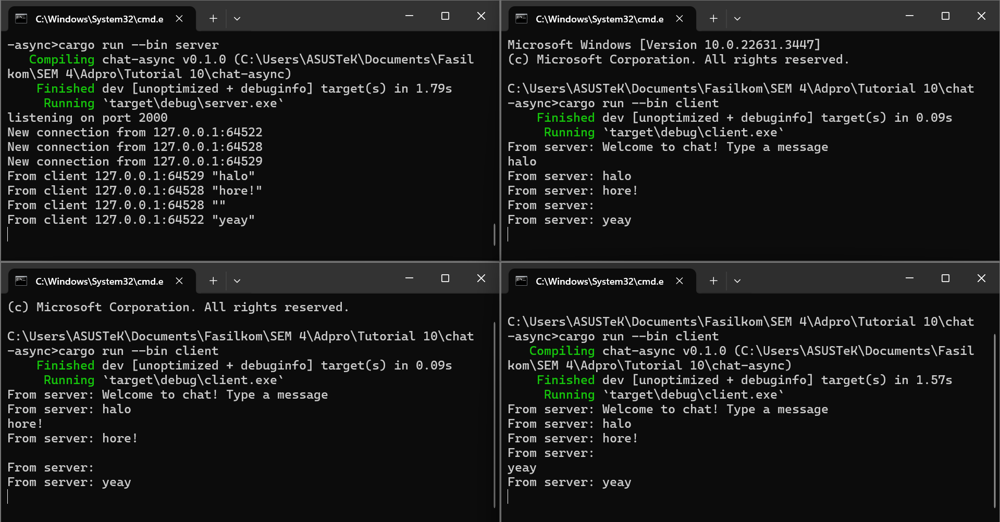

# Module 10: Asynchronous Programming
## Tutorial Advanced Programming 2023/2024 Genap

* Nama  : Tengku Laras Malahayati
* NPM   : 2206081641
* Kelas : A

## Reflection
### 2.1 Original Code of Broadcast Chat

First, I execute the command `cargo run --bin server` to start the server. Following that, I launch the client using
`cargo run --bin client`. This client automatically connects to the server. As shown in the above image, whenever I type
a message on the client side, the server receives it and displays the output `From client 127.0.0.1: "message"`. 
Additionally, other clients are able to see the messages sent by other clients because the server relays them with the notation `From server: message`.

### 2.2 Modifying The Websocket Port
In order to modify the port to port 8080, both the connection from server's and client's sides need to be modified. To
modify the server's port, I changed this part (marked red) from 2000 to 8080 which defines which port it uses.

To modify the client's port, I changed this part (marked red) from 2000 to 8080 which defines which port it uses.

I also made sure that both server and client are using the same websocket protocol, so I tested it by executing the commands
that I previously used on 2.1. Here is the output:

### 2.3 Small changes. Add some information to client
I added the information about the sender, its IP, and its Port by adding `bcast_tx.send(format!("{addr} : {text}"))?;`
and modifying `println!("New connection from Laras' Computer {addr:?}");` in `server.rs`. Furthermore, I also modified
`println!("Laras' Computer - From server: {}", text);` in `client.rs`. I made those modifications so that the sender's information
can be seen as a broadcast message on the terminal. Here is the output sample:

Server:

Client:
